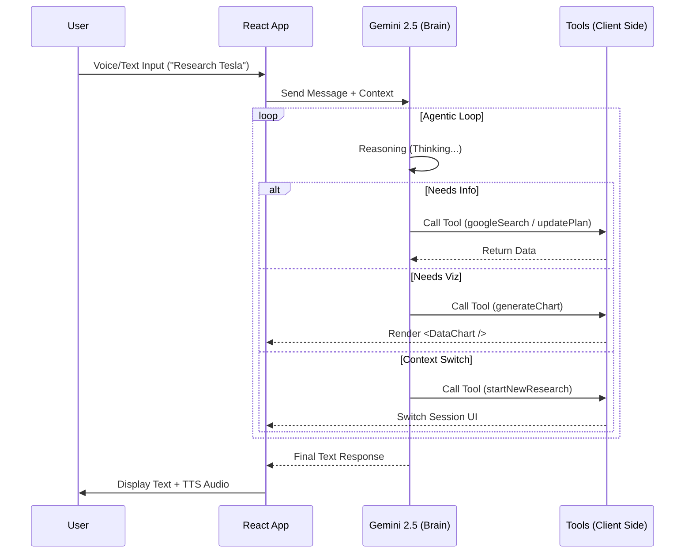

# Company Scout AI - Agentic Research Assistant with Multi-Modal RAG

> An S-Tier conversational agent that autonomously researches companies, visualizes financial data, and adapts its persona to user needs. Built with Google Gemini 2.5 Flash.

## 🧠 Architecture Overview

Company Scout AI is designed as a **client-side agentic workflow**. It moves beyond simple "chatbot" interactions by giving the LLM distinct tools to manipulate the application state and UI directly.

*   **The Brain (Model):** Google Gemini 2.5 Flash. Chosen for its extreme speed and low latency, essential for real-time voice interactions and tool calling.
*   **The Body (Frontend):** React 19 + TypeScript + Tailwind CSS. Features a "Glassmorphism" UI design with responsive animations.
*   **The Memory (State):** LocalStorage + React State. Ensures privacy-first, zero-config persistence of research sessions across browser refreshes.

## ✨ Key Features (The Flex)

### 1. Agentic Orchestration & Context Switching
Unlike standard chat interfaces, Scout AI monitors the conversation for intent shifts.
*   **Autonomous Tooling:** The agent decides *when* to update the account plan, *when* to visualize data, and *when* to search the web.
*   **Context Awareness:** If you are researching "Nike" and suddenly ask "What about Adidas?", the agent detects the entity change and triggers a `startNewResearch` tool call, autonomously archiving the old session and spinning up a new workspace.

### 2. Generative UI (Dynamic Charting)
The application implements **Generative UI** patterns. The LLM doesn't just output text; it outputs structured data that the frontend renders into interactive components.
*   **Capability:** If the agent finds financial data (e.g., "Revenue grew 20% to $50M"), it autonomously calls `generateChart`.
*   **Implementation:** A custom, zero-dependency SVG renderer draws animated Bar and Line charts instantly within the chat stream.

### 3. Multi-Modal Analysis
Scout AI is not text-bound.
*   **Vision Capabilities:** Drag and drop financial reports, graphs, or product images into the chat. The agent uses Gemini's vision capabilities to analyze the visual data and incorporate it into the strategic plan.

### 4. Voice-Native Interaction
Designed for "hands-free" research sessions.
*   **Speech-to-Text:** Real-time transcription using the Web Speech API.
*   **Text-to-Speech:** The agent "reads" its findings back to you using synthesized speech, allowing for podcast-style information consumption.

## 🛠️ Technical Decisions

### Why Custom SVG Charts?
**Decision:** Instead of importing heavy libraries like Recharts or Chart.js (adding ~300kb to the bundle), I implemented a custom `<DataChart />` component using raw SVG and Tailwind.
**Result:** Zero-bundle-size overhead, granular control over animations, and perfect aesthetic alignment with the app's dark mode theme.

### Why Local Storage?
**Decision:** Using `localStorage` for session persistence.
**Result:** The app is fully functional immediately upon clone. No database setup, no Docker containers, and complete user privacy (data never leaves the browser except to go to the LLM).

### Why Gemini 2.5 Flash?
**Decision:** Upgrading from 1.5 Pro to 2.5 Flash.
**Result:** The latency for tool calling dropped significantly, making the "Agentic Loop" (Thought -> Tool Call -> Action -> Response) feel instantaneous.

## 🔄 System Flow



## 🚀 Setup Instructions

1.  **Install Dependencies**
    ```bash
    npm install
    ```

2.  **Environment Setup**
    The app requires a Google Gemini API Key.
    *   Create a `.env` file in the root.
    *   Add: `API_KEY=your_gemini_api_key_here`

3.  **Run Development Server**
    ```bash
    npm run dev
    ```

## 📜 License

MIT License. Built for the future of work.